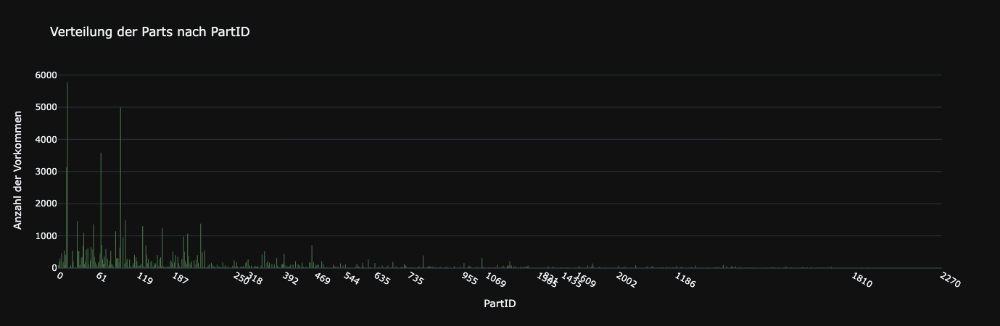

# KI-Projekt

## Einleitung

In diesem Projekt wurde ein Ansatz entwickelt, um Baugruppen basierend auf gegebenen Bauteilen als Graphen vorherzusagen. Dabei wurden maschinelle Lernmethoden mit klassischen graphentheoretischen Ansätzen kombiniert. Ziel war es, ein Modell zu erstellen, das sowohl präzise als auch effizient arbeitet und dabei die Besonderheiten der Bauteildaten (Bauteil ID und Familie) berücksichtigt.
Wir erreichen mit unserem Hauptansatz (Edge Prediction FFN + Minimal Spanning Tree) eine Edge Accuracy von ca. 97% und sagen ca. 66% aller Graphen exakt richtig vorraus.

## Hinweise zur Ausführung und Struktur des Repositories

Das Repository ist wie folgt strukturiert:

```
├── Datenauswertung.ipynb
├── edge_prediction_models/
├── prediction_classes/
├── train/
├── ffn.py
```

- **`train/`**: Enthält die Notebooks, in denen die verschiedenen Modelle trainiert wurden.
- **`prediction_classes/`**: Beinhaltet die Predictor-Klassen, die für die eigentlichen Vorhersagen zuständig sind. Diese Klassen sind mit der `MyPredictionModel`-Basisklasse kompatibel.
- **`edge_prediction_models/`**: Enthält die gespeicherten PyTorch-Modelle, die für die unterschiedlichen Ansätze relevant sind.
- **`ffn.py`**: Implementiert das Basis-Feedforward-Netzwerk, das in unserem Hauptansatz verwendet wird.

> **Hinweis:**  
> - In den Basisklassen (`Graph` und `Node`) wurden zwei zusätzliche Funktionen implementiert, die für den GNN-Ansatz erforderlich sind  
> - Die Funktion `evaluate()` wurde erweitert, sodass sie nun ein Dictionary mit zwei Metriken (Edge Accuracy, Exact Match) zurückgibt, anstatt nur einen einzelnen Wert. 
> - Das Skript `evaluate.py` kann direkt ausgeführt werden, um die Ergebnisse der Modelle zu berechnen und anzuzeigen

Im Folgenden wird die Implementierung beschrieben, wobei der Fokus auf der Methodik, den durchgeführten Experimenten und den erzielten Erkenntnissen liegt.


## Datenanalyse
*Der Code für die Auswertung ist im Notebook **"Datenauswertung"** zu finden.*

Bevor wir mit der Erstellung der Modelle begonnen haben, wurden die zur Verfügung gestellten Graphen genauer analysiert. Dabei wurden folgende Fragen untersucht:

- Wie viele Knoten gibt es pro Graph, und welche Graphengrößen treten wie häufig auf?  
- Wie sind die Knoten auf die jeweiligen Familien verteilt? Welche Familie ist die größte, welche die kleinste und wie groß sind sie jeweils?  
- Wie häufig kommen die einzelnen Parts vor, und gibt es hier große Unterschiede?  
- Wie stark sind die einzelnen Familien miteinander verbunden?  
- Wie stark sind einzelne Parts miteinander verbunden? *(Die Matrix wird hier aufgrund ihrer Größe nicht eingebunden. Sie bestätigt jedoch, dass die meisten Parts fast nie miteinander verbunden sind. Dies rechtfertigt direkt den ersten "naiven" Ansatz.)*

Die Antworten auf diese Fragen lassen sich der Reihe nach aus den folgenden Plots ableiten, sind aber ausführlicher im Datenauswertung.ipynb Notebook dargestellt:

<div style="display: grid; grid-template-columns: repeat(1, 1fr); gap: 10px; justify-items: center;">
    <div>
        
        <p style="text-align: center;">(1) Verteilung der Knoten pro Graph</p>
    </div>
    <div>
        
        <p style="text-align: center;">(2) Verteilung der Parts pro Familie</p>
    </div>
    <div>
        
        <p style="text-align: center;">(3) Verteilung der Parts nach PartID</p>
    </div>
    <div>
        
        <p style="text-align: center;">(4) Matrix Interfamilyconnection</p>
    </div>
</div>

---


## Erster Versuch: "Naiver" Ansatz

Ein weiterer Ansatz bestand darin, ein äußerst simples instanzbasiertes Verfahren zu testen. Während des Trainingsprozesses werden sämtliche Kanten und ihre Häufigkeiten gespeichert. Zur Laufzeit werden alle möglichen Kombinationen von Parts generiert, anschließend wird geprüft, welche Kombinationen am häufigsten auftreten. Die häufigsten Kombinationen werden dann in den Graphen eingefügt, bis n-1 Kanten erreicht sind und alle Knoten miteinander verbunden sind.

Bemerkenswerterweise erzielte dieser Ansatz bereits eine Edge Accuracy von knapp 93,7% und Exact Match von 34,5%. Exact Match bedeutet, dass der Graph vollständig richtig vorhergesagt ist, also alle Kanten übereinstimmen. Dennoch wollten wir zusätzlich auch andere „echte“ KI-Methoden evaluieren, um das Potenzial weiter auszuschöpfen.

## Hauptansatz: Edge Prediction FFN + Minimal Spanning Tree

### Methodik und Vorgehensweise

##### Ausgangspunkt und erste Experimente

- **Ansatz mit Adjazenzmatrix:**  
  Ursprünglich sollte das Modell eine vollständige Adjazenzmatrix vorhersagen. Dies wurde jedoch verworfen, da die Matrix mit einer Größe von ca. 2000*2000 den Speicherplatz deutlich überschritten hätte und kein effektives Training möglich war. Außerdem hätte man trotzdem noch das Problem gehabt, dass Teile auch mehrfach vorkommen können und daher die Matrix noch nichteinmal ausreichend gewesen wäre.

- **Reduzierung auf Kantenpaarvorhersage:**  
  Stattdessen wurde die Problemstellung vereinfacht, indem das Modell für jedes Knotenpaar separat die Wahrscheinlichkeit für eine Verbindung vorhersagt. Dadurch konnte das Problem in zwei kleinere Problemstellungen aufgeteilt werdne. Dieser Ansatz schien uns vor allem schlüssig, da wir durch den "Naiven Ansatz" ja bereits wussten, dass man mit den Kantenwahrscheinlichkeiten ganz gute Ergebnisse erziehlen kann. 

#### 1. Vorhersage von Kanten-Wahrscheinlichkeiten

Der erste Schritt bestand darin, für alle möglichen Knoten paarweise die Wahrscheinlichkeiten zu berechnen, ob zwischen ihnen eine Kante besteht. Diese Vorhersage wurde mit einem **Feedforward-Netz (FFN)** realisiert.


#### Feature-Repräsentation

Für die Eingabedaten wurden zwei Varianten der Feature-Repräsentation getestet:

1. **Family-ID-basierte Eingaben:**  
   Die Family-ID fasst Bauteile mit ähnlichen Eigenschaften in Gruppen zusammen. Diese kompakte Darstellung reduzierte die Eingabedimension auf etwa 100, was ressourcenschonender war.  

2. **Part-ID-basierte Eingaben:**  
   Die Part-ID enthält spezifische Informationen zu jedem einzelnen Bauteil und ermöglichte eine detailliertere Repräsentation. Dies führte jedoch zu einer deutlich höheren Eingabedimension von etwa 2000.


Zusätzlich wurden die Features der Graphen folgendermaßen kodiert und anschließend zusammengefügt:  
- **Frequency-Encoding:** Die Bestandteile des Graphen wurden frequency-encoded, um ihre Häufigkeit in den Daten zu berücksichtigen.  
- **One-Hot-Encoding:** Die Part-ID oder Family-ID wurde als One-Hot-Vektor kodiert, um eindeutige Identifikationen zu gewährleisten.  

Das Target war ein Vektor, der die Verbindungen des jeweiligen Knotens darstellte: Für jeden verbundenen Knoten wurde der entsprechende Wert auf `1` gesetzt, während die Werte für nicht verbundene Knoten `0` blieben.

##### Hyperparameteroptimierung

Die Hyperparameter (z. B. Anzahl der Neuronen im Hidde-Layern, Lernrate, Batchgröße) wurden mit verschiedenen Methoden untersucht:  
- **Random Search:** Wurden vor allem bei frühen Experimenten im Modul `FamilyFFN` verwendet.  
- **Manuelle Optimierung:** Für das finale Modell wurden die vielversprechendsten Kombinationen von Parametern manuell getestet und angepasst, da dies in der Praxis oft schneller zu verwertbaren Ergebnissen führte. Insbesonder wenn man nicht so viele Erfahrung hat in diesem Bereich, fanden wir es auch hilfreich, dass Training wirklich zu beobachten und Auswirkung der Hyperparamtern zu betrachten und nicht nur auf die Accuracy am Ende zu achten.

**Finales Modell:**  
Das finale Feedforward-Netzwerk wurde mit Cross-Validation trainiert. Wir haben uns auf das Modell mit den PartIDs konzentriert. Der Codes des Trainings ist in ```train/PartFFN``` zu sehen. Dort ist das Vorgehen auch noch genauer beschrieben.


#### 2. Graph-Aufbau aus den Wahrscheinlichkeiten

Nach der Vorhersage der Kantenwahrscheinlichkeiten war der nächste Schritt der Aufbau eines gültigen Graphen.

##### Iterative Ansätze

Zunächst wurden heuristische Methoden getestet, bei denen sukzessive die wahrscheinlichsten Kanten hinzugefügt wurden. Dies führte jedoch zu mehreren Problemen:
- Zyklen zu verhindern, war eine aufwendige Aufgabe 
- Self-Loops und mehrfach vorkommende Bauteile erschwerten die Umsetzung

##### Minimal-Spanning-Tree-Ansatz (MST)

Das Problem wurde schließlich als klassisches Graphenproblem erkannt. Die Lösung bestand darin, alle möglichen Kanten mit inversen Wahrscheinlichkeiten zu gewichten und mithilfe der **NetworkX-Bibliothek** einen Minimal-Spanning-Tree (MST) zu berechnen. Dies ermöglichte:
1. Einen garantiert azyklischen und verbundenen Graphen
2. Eine effiziente Berücksichtigung der Wahrscheinlichkeiten


### Beobachtungen und Erkenntnisse

#### Ergebnisse

- **Edge-Accuracy:** Die Vorhersage der Kanten erreichte konsistent eine hohe Genauigkeit von etwa 96%-97%.  
- **Exact Match Accuracy:** Wir erziehlten eine Exact Match Accuracy von ca. 66%


#### Herausforderungen und Limitierungen


1. **Ressourcenbedarf:**  
   - Die Verwendung von Part-IDs führte, insbesondere da wir bis zu 2000 Part-IDs definiert haben, von denen nur etwa die Hälfte tatsächlich genutzt wird, zu einem erhöhten Speicher- und Rechenaufwand. Dies zeigte sich besonders bei der Hyperparameteroptimierung. Eine mögliche Verbesserung wäre die Implementierung eines Mappings vor und nach der Prediction, um die Dimension des Input-Vektors um etwa 75 % und die des Output-Vektors um 50 % zu reduzieren. Diesen Ansatz haben wir bei dem GNN weiterverfolgt. Von dieser Optimierung haben wir jedoch hier abgesehen, da bei Hinzufügen neuer Bauteile, die in den ursprünglichen Bereich der ID-Zuweisung fallen, das gesamte Training von Grund auf neu gestartet werden müsste und die Performance auf unsere Hardware auch so ausreichend war und wir somit auch mit Bauteilen umgehen könten, die dazwischen liegen. 

2. **Trade-off zwischen Edge- und Exact Match Accuracy:**  
   - Längeres Training des Modells verbesserte die Genauigkeit einzelner Kanten (Accuracy des Kanten Prediction Modells), führte jedoch nicht immer zu einer Verbesserung der genauen Graphenrekonstruktion (Exact Match).  
   - Mögliche Ursache: Das Modell fokussierte sich zunehmend auf häufige Kanten, was zwar den Loss reduzierte, aber die Rekonstruktion ganzer Graphen negativ beeinflusste.

3. **Fehlende End-to-End-Optimierung:**  
   - Das Modell optimiert nur die Vorhersage der Kantenwahrscheinlichkeiten, nicht jedoch das Gesamtergebnis des Graphenaufbaus. Ein End-to-End-Ansatz könnte diese Schwäche adressieren. Deshalb haben wir danach noch versucht, mittels eines GNNs die Aufgabe noch besser zu erledigen. 


#### Erkenntnisse:

- Die Kombination aus Feedforward-Netzwerk und graphentheoretischen Methoden (MST) lieferte gute Ergebnisse bei der Vorhersage von Baugruppen.  
- Cross-Validation und manuelle Hyperparameteroptimierung erwiesen sich als entscheidend für die Modellverbesserung.


---
## Zusätzlicher Versuch: Graph Neural Network mit Word-Embeddings
Nachdem der erste Ansatz vielversprechende Ergebnisse geliefert hat, haben wir uns an die Umsetzung eines zweiten, komplexeren Ansatzes gewagt. 
Dieser zweite Ansatz sollte alternativ die Kanten **schrittweise** vorhersagen und den Graphen damit
wachsen lassen. Dafür wollten wir ein GNN erstellen und trainieren.


### Methodik und Vorgehensweise
Der Ansatz verfolgt das Ziel, die "Interessen" der einzelnen Parts zu lernen, 
anstatt nur die Wahrscheinlichkeiten für Kanten zwischen Knoten vorherzusagen. 
Hierzu wird zunächst Word2Vec verwendet, um Embeddings für die Knoten zu erzeugen, 
die dann als Input für das GNN dienen. 

Die Methodik gliedert sich in folgende Schritte:
1. **Kontextgenerierung für die Knoten**
2. **Training des Word2Vec-Modells**
3. **Integration der Embeddings in ein Graph Neural Network**
4. **Schrittweise Vorhersage eines Graphen ausgehend von einer Bauteil-Multimenge**

---

### Kontextgenerierung und Word2Vec
Als ersten Schritt haben wir Kontexte aus den gegebenen Graphen generiert, 
um diese als Input für ein Word2Vec-Modell zu nutzen. Ursprünglich wurde überlegt, 
Node2Vec zu verwenden, welches auf Random Walks basiert, um Knoten-Embeddings zu erstellen. 
Allerdings sind Random Walks in unserem Kontext nicht geeignet, da die Beziehungen zwischen Knoten 
nicht von weit entfernten Knoten abhängen. Daher fiel die Wahl auf Word2Vec mit einer festen Fenstergröße.

- **Fenstergröße:** Wir haben uns für `windowsize=2` entschieden, da weiter entfernte Knoten keinen Einfluss mehr auf die Verbindungen haben sollen.
- **Entfernung der NodeIDs:** Die NodeIDs wurden beim Training mit Word2Vec entfernt, da sie keine relevante Information für die Beziehungen enthalten.

Der folgende Plot zeigt die Embeddings nach einer Dimensionsreduktion mittels t-SNE. 
Es wird gut sichtbar, dass Word2Vec erfolgreich die Ähnlichkeiten zwischen den Knoten gelernt hat. 
Die Instanzen einer Familie (hier exemplarisch FamilyID "0") bilden klare Cluster:


### Graph Neural Network
Ein GNN wurde entwickelt, um die binäre Link-Prediction durchzuführen. 
Das bedeutet, das Modell sagt für ein Knotenpaar voraus, 
ob eine Kante zwischen ihnen existiert oder nicht (als Score).

#### Details zum Modell:

- **Negatives Sampling:** Negative Kanten werden für das Training generiert, um auch negative Beispiele zu lernen.
- **Zwei Layer im GNN:** Das GNN propagiert Informationen über maximal zwei Knoten hinweg.
- **Permutation-Invariance:** Das Modell ist invariant gegenüber der Reihenfolge der Knoten im Graphen. Deshalb wird im Training ausschließlich mit den Eigenschaften der Parts gearbeitet und die KnotenID verworfen.


### Schrittweiser Aufbau des vorhergesagten Graphen
- **Startknoten:** Mithilfe einer Heuristik aus Constraint Solving wird der "Most-Constrained" (MC) Knoten als Startpunkt ausgewählt. Der MC-Knoten ist hier derjenige, der im Trainingsdatensatz im Durchschnitt den höchsten Grad aufweist.
- **Iterativer Aufbau:** Basierend auf den vorhergesagten Wahrscheinlichkeiten werden die Knoten und Kanten schrittweise zum Graphen hinzugefügt. Knoten mit den höchsten Scores werden bevorzugt ausgewählt.

Der Ablauf ist wie folgt:
1. **Bestimmung des Startknotens:**  
   Bestimme den im Schnitt "most-constraint" Knoten (Knoten mit dem höchsten durchschnittlichen Grad im Trainingsdatensatz) als Startknoten.  
   *(Alternativ könnte ein zufälliger Knoten verwendet werden, dies wurde jedoch nicht getestet.)*

2. **Vorhersage der Kanten-Scores:**  
   Sage die Scores für die Kanten zu allen anderen möglichen Knoten vorher.

3. **Akzeptanz von Kanten:**  
   Akzeptiere die Kanten, deren Scores einen festgelegten Schwellenwert (Threshold, z. B. 0.5) überschreiten.

4. **Hinzufügen von Kanten und Knoten zum Graphen:**  
   Füge akzeptierte Kanten und Knoten zum Graphen hinzu.  
   Entferne diese Knoten aus der Menge der nicht-zugewiesenen Knoten und verwende sie jeweils als Input für Schritt 2.

5. **Speicherung der besten Kanten für verbleibende Knoten:**  
   Für nicht hinzugefügte Knoten wird jeweils die Kante mit dem besten Score gespeichert, damit kein Knoten übrig bleibt.  
   Nicht verwendete Knoten werden am Ende ihrer jeweils besten Kante hinzugefügt.

Dieser schrittweise Aufbau erlaubt es dem Modell, die Graphstruktur nach und nach zu rekonstruieren, indem es sich an den bisherigen Teilergebnissen orientiert.

---

##### Hyperparameteroptimierung

Da das Modell in dieser frühen Phase noch nicht vollständig ausgereift war, wurde auf eine umfangreich systematische Optimierung verzichtet.
Während der Implementierung wurden auf eine sinnvolle und möglichst gute Hyperparameterauswahl geachtet.


#### Herausforderungen
Die größte Herausforderung war, dass das Modell die Implementierung zahlreicher zusätzlicher Komponenten erfordert und es somit relativ lange dauert,
bis man einen lauffähigen Ansatz erstellt hat. Diese Komponenten sind unter anderem: Kontextgenerierung, Word2Vec-Training, Negative Sampling, Erstellung von Teilgraphen,
Schrittweiser Aufbau des Graphen, evtl. ein Policy-Layer zur Vermeidung ungültiger Graphen, ein globales Index Mapping, ...

Daher wurde dieser Ansatz nicht komplett zu Ende implementiert. Fehlende Komponenten sind beispielsweise die Generierung
und das Training mit Teilgraphen. 


### Zusammenfassung

Das Modell hat gezeigt, dass es grundsätzlich in der Lage ist, Beziehungen zwischen Knoten zu lernen und Graphen schrittweise aufzubauen. 
Allerdings ist die Implementierung weitere Komponenten (insbesondere Training mit Teilgraphen) notwendig, 
um ein gut funktionierendes und leistungsstarkes GNN zu entwickeln.

**Erkenntnis**
Der schrittweise Aufbau eines Graphen ist eine vielversprechende Methode, ist aber für das hier behandelte Problem
ein viel zu aufwendiger Ansatz, da sich mit weniger Komplexen Modellen bereits sehr gute Ergebnisse erzielen lassen.
